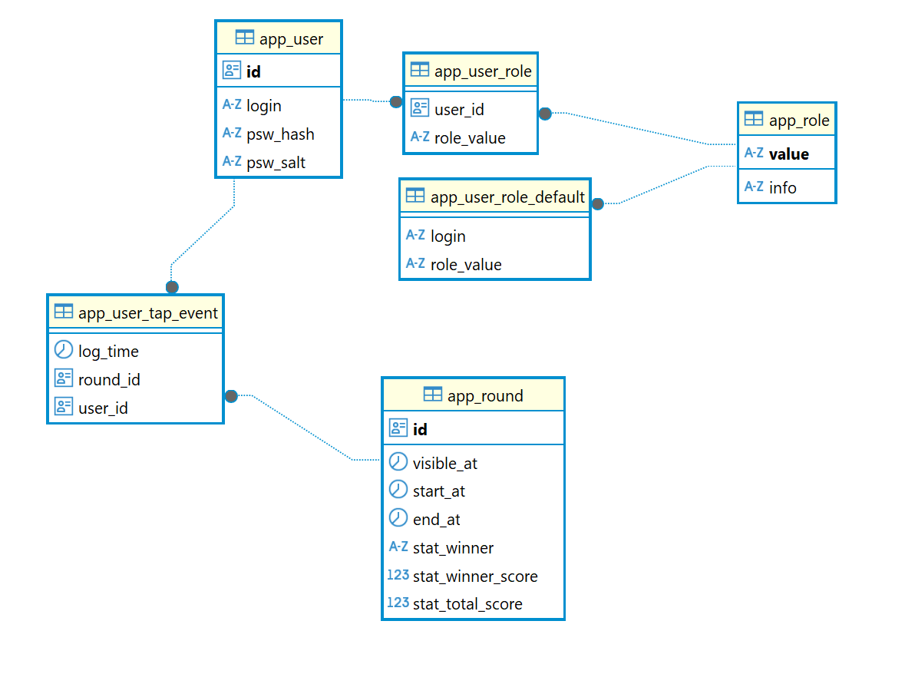

# round-squares-tech-task
<!-- TOC -->
* [round-squares-tech-task](#round-squares-tech-task)
  * [Запуск](#запуск)
    * [Server](#server)
    * [Front](#front)
  * [Особенности реализации](#особенности-реализации)
    * [DB](#db)
    * [Server](#server-1)
    * [E2E Тесты](#e2e-тесты)
    * [Front](#front-1)
  * [Тест RPC](#тест-rpc)
<!-- TOC -->


Реализация задачки ["The Last of Guss"](https://github.com/round-squares/tech-task-for-interview/wiki)

## Запуск
### Server
- Предполагается, что на машине локально доступен Postgre сервер
- Прописать доступ к БД в файле `/server/.env`
```
DB_HOST = localhost
DB_PORT = 5432
DB_USER = postgres
DB_PSW = admin
DB_DATABASE = guss
DB_SSL = false
```
- Таблицы в БД будут созданы при первом запуске сервера и его коннекта к БД
- Описание схемы лежит в `/server/db/migrations`
- Если БД доступно, то можно собирать сервер и запускать
```bash
$ cd ./server
$ npm install
$ npm run start
```
- Сервер будет запущен на порту 3000 по-умолчанию
- Лог корректно запущенного сервера
```
> guss-server@0.0.1 start
> nest start

[infrastructure/db_migration]  db migration start: localhost:5432 ...
[infrastructure/db_migration]  db migration done.
[Nest] 58500  - 31.08.2025, 07:10:50     LOG [NestFactory] Starting Nest application...
...
[app]  Application is running on: http://[::1]:3000
```
- Можно посмотреть REST api сервера тут: http://localhost:3000/docs


### Front
- Предполагается, что сервер уже успешно запущен на `localhost:3000`
- Настройка доступа АПИ серверу в файле `/front/.env`
```
VITE_SERVER_URL=http://localhost:3000
```
- Запуск фронта
```bash
$ cd ./front
$ npm install
$ npm run dev
```
- Фронт будет запущен на порту 4000 по-умолчанию
- Лог корректно запущенного фронта
```
 VITE v6.3.5  ready in 629 ms
  ➜  Local:   http://localhost:4000/
  ➜  Network: use --host to expose
  ➜  press h + enter to show help
```


## Особенности реализации
### DB
- Общая схема БД

- Каждый успешный тап юзера сохраняется в `app_user_tap_event`
- Статистика по завершенному раунду добавляется отдельно сервером в поля `app_round.stat_...`
- Текущие роли юзера привязаны в таблице `app_user_role`
- При создании юзера ему назначаются роли, указанные в `app_user_role_default`

### Server
- Модель данных на сервере генерируется по схеме БД в раздел `server/src/generated`
- Обновить исходники можно командой `npm run drizzle:generate-schema`
- Сервис работы с раундами лежит в `server/src/round/round.service`
- Отложенный расчет статистики по завершенному раунда делает сервис `server/src/round/round_stat.service.ts`
- Созданием юзера или повторным входом занимается сервис `server/src/auth/auth.service.ts`
- После успешного логина на клиент передается JWT токен
- Механизм JWT refresh для данного проекта не реализован, тк усложнит понимание демо-проекта

### E2E Тесты
- Используется докер для БД и фреймворк [Testcontainers](https://testcontainers.com/modules/postgresql/)
- Кейсы тестов лежат в `server/test/cases`
- Запуск через `npm run test:e2e`

### Front
- В качестве state выбран `React Query` 
- Библиотека визуальных компонентов `MUI`
- Модель данных на фронте генерируется через OpenApiGenerator в раздел `front/src/generated`
- Обновить исходники можно командой `npm run api:generate`
- JWT токен авторизации пока что хранится в localStorage для простоты демонстрации проекта
- Во время игры тапы юзера сохраняются в localStorage для интерактивности
- После игры подтягиваются данные из сервера, локальные данные тапов удаляются

## Тест RPC
- Тест на локальной машине с локальной БД (RAM 32GB, CPU Intel 12 i7)
- Через [ApacheBench](https://en.wikipedia.org/wiki/ApacheBench)
- Команда вызова: `ab -n 10000 -c 100 "http://localhost:3000/v1/round/tap?..."` с подстановкой валидного jwt-token
- Результаты:
```bash
Concurrency Level:      100
Time taken for tests:   10.421 seconds
Complete requests:      10000
Failed requests:        0
Write errors:           0
Requests per second:    959.58 [#/sec] (mean)
Time per request:       104.212 [ms] (mean)
Time per request:       1.042 [ms] (mean, across all concurrent requests)
Transfer rate:          287.69 [Kbytes/sec] received

Percentage of the requests served within a certain time (ms)
  50%     99
  66%    107
  75%    112
  80%    114
  90%    123
  95%    137
  98%    151
  99%    177
 100%    243 (longest request)
```